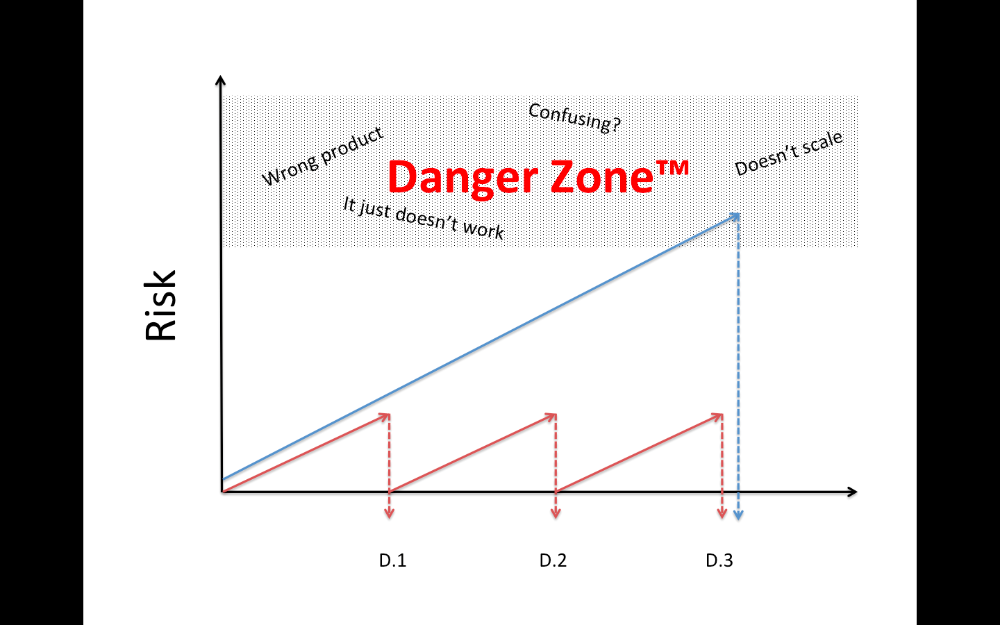

# Market drivers (What's happening and why you should care)

## Use continuous integration (CI) to reduce your overall project risk profile.

Software legend Martin Fowler defines [continuous deployment](http://www.martinfowler.com/articles/continuousIntegration.html) as "a software development practice where members of a team integrate their work frequently, usually each person integrates at least daily - leading to multiple integrations per day."  Fowler's seminal article defines the key best practices as:

* Maintain a Single Source Repository.
* Automate the Build
* Make Your Build Self-Testing
* Everyone Commits To the Mainline Every Day
* Every Commit Should Build the Mainline on an Integration Machine
* Keep the Build Fast
* Test in a Clone of the Production Environment
* Make it Easy for Anyone to Get the Latest Executable
* Everyone can see what's happening
* Automate Deployment

While there are many technical benefits to this process, perhaps the key business benefit is an overall reduction in the risk profile for a project.  Risk might include things like changes in the market condition, lack of user feedback, and a host of other hard and soft factors.  Entrepreneur Lukas Fittl shows the process effect of CI as a [sawtooth curve](http://www.slideshare.net/lfittl/we-built-itandtheydidntcome) that minimizes risk through frequent deploys:

